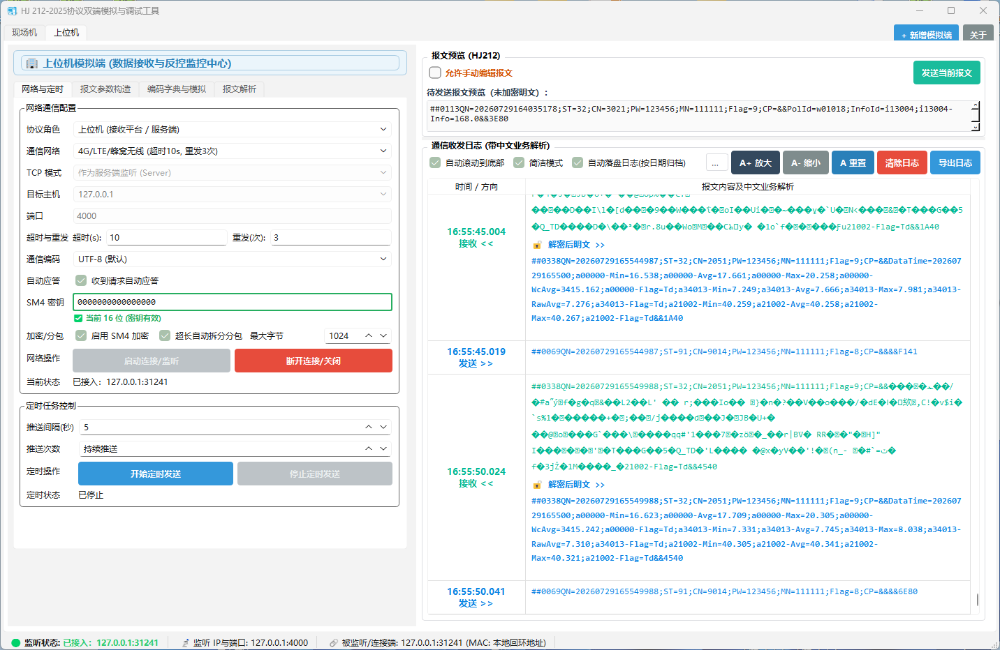
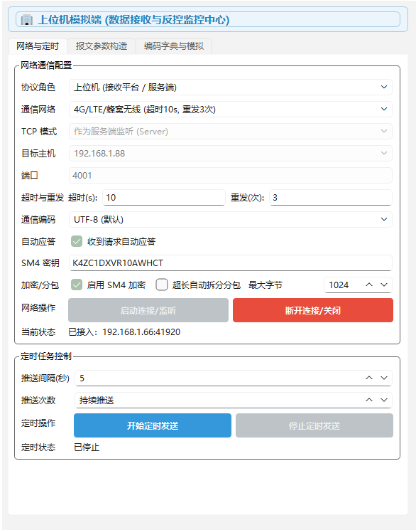
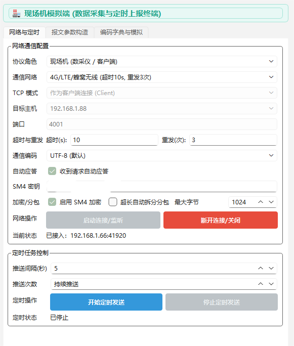
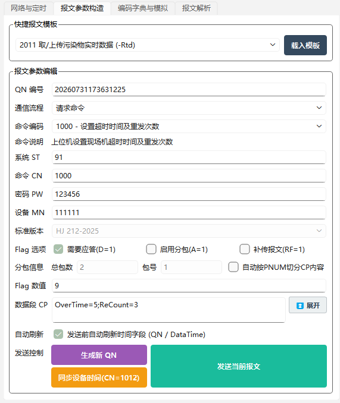
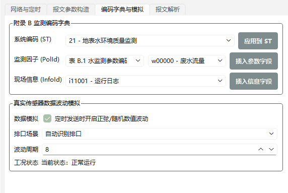
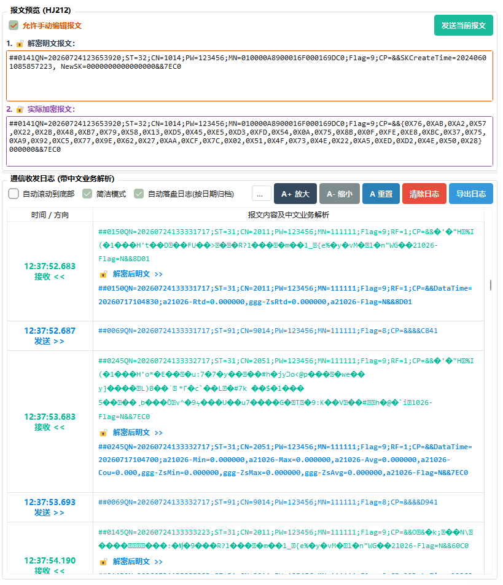
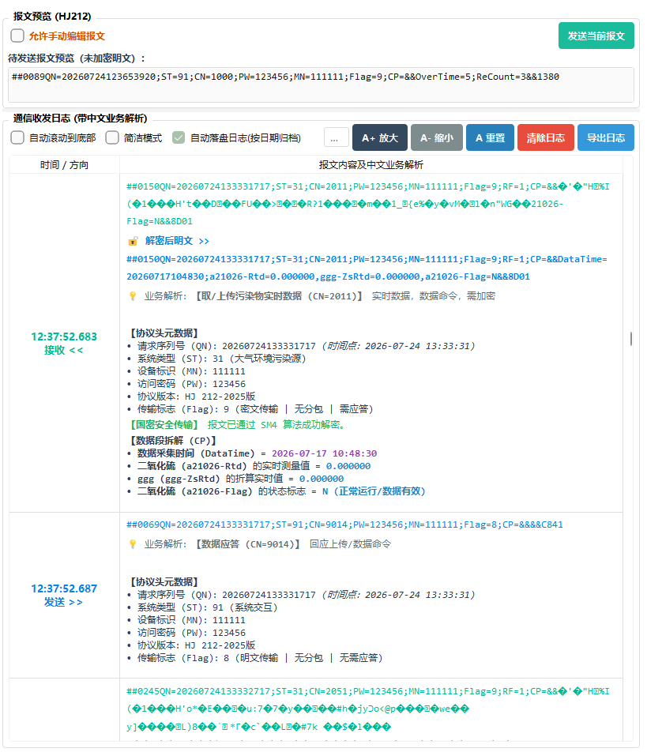
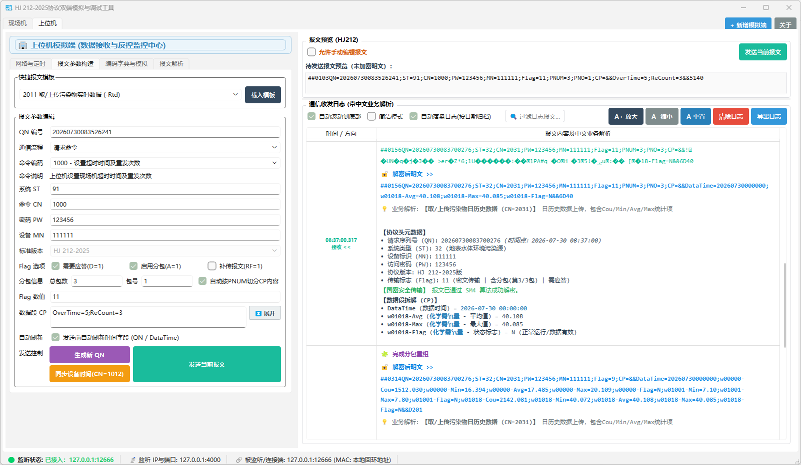
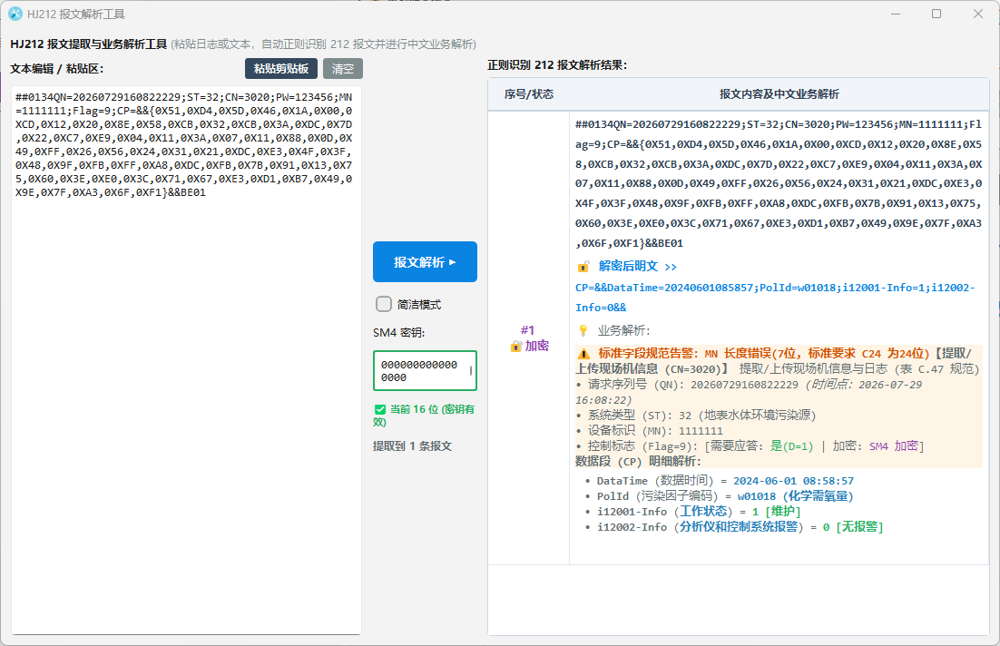

# HJ 212-2025协议双端模拟与调试工具

一个环保数据传输测试工具。专门用于模拟 **上位机（环保平台）** 与 **现场机（数采仪/在线分析仪）**，遵循 《HJ 212-2025》、《HJ 212-2017》 与 《HJ/T 212-2005》 标准。

适合环境监测设备厂商、上位机软件开发商、环保物联网运维人员进行 **本地双端对调、现场设备联调、国密 SM4 加密验证、超长分包测试、异常低值修正及报文业务拆解**。

---

## 核心特性

- **同窗双端独立模拟**：可在同一个界面中动态切换“模拟端 1”与“模拟端 2”，一键配置上位机（接收端）或现场机（发送端），双端互不干扰。
- **国密 SM4 加密支持**：遵循 HJ 212-2025 附录 A.2 标准（ECB 模式、Nopadding、16字节切片），支持十六进制密文 `&&{Hex}&&` 与字符密文的双重自适应解密。
- **超长报文分包与重组**：自动计算 `PNUM`/`PNO` 拆分多包发送，接收端具备防 `\r\n` 截断的二进制流缓冲区，重组完整报文后再触发自动应答。
- **Flag 标志位位运算引擎**：基于标准算式生成 Flag，自动解析 2025版、2017版、2005版协议版本。
- **真实传感器波动与工况状态机**：内置正弦波振幅、高斯随机噪声及 `N`(正常)、`Stc`(稳定)、`Td`(故障)、`C`(校准) 4 阶段工况自动轮换引擎。
- **HTML 会话日志自动落盘归档**：启动连接时自动在 `logs/yyyy-MM-dd/` 文件夹下按日期归档落盘 HTML 日志，采用追加流写入，全量 100% 留存。

---

## 界面功能导览与配置截图

### 1. 双端通信角色与网络配置

软件支持上位机（Server/Client）与现场机（Server/Client）独立动态切换：

| 🏢 上位机模拟端 (Upper Role) | 🏭 现场机模拟端 (Field Role) |
| :---: | :---: |
|  |  |

---

### 2. 报文参数编辑与可视化构造

支持对 `QN`, `ST`, `CN`, `PW`, `MN`, `Flag`, `PNUM`, `PNO` 及 `CP` 数据段进行图形化编辑与即时校验，自动计算 `Flag` 值并高亮呈现：

---

### 3. 编码字典一键插入与传感器波动模拟

点击左侧参数区 **`【编码字典与模拟】`** 选项卡，在 **`【真实传感器数据波动模拟】`** 分组框中开启数据与工况自动轮换模拟：

---

### 4. 报文实时预览、简洁模式与日志搜索导出

右侧面板提供原报文预览、SM4 解密明文，可一键切换简洁模式与完整业务解析模式，支持日志过滤检索与 HTML 导出：

| 📋 日志收发与搜索 (简洁模式) | 💡 日志收发与业务解析 (完整模式) |
| :---: | :---: |
|  |  |

---

### 5. 自动分包与防截断重组界面 (PNUM / PNO)

勾选【启用分包】并设定 PNUM 后，系统会自动按分号按数据项切片分包；在需要应答模式下，上位机与现场机自动按《HJ 212-2025 表 C.58》标准建立交替推发流水线，并在全套子包到达后自动重组完整报文：

---

### 6. 独立报文提取与业务解析工具 (`HJ212PacketParser.exe`)

提供独立进程运行的 212 报文提取与业务解析工具，可粘贴文本/日志自动正则识别 212 报文并进行中文业务解析，支持多行 SM4 密钥解密与简洁模式切换：

---

##  快速使用指南

### 场景一：同窗本地闭环联调测试

1. 启动软件，默认打开 **【模拟端 1】** 与 **【模拟端 2】**；
2. 在 **【模拟端 1】** 设置为 `协议角色: 上位机`, `TCP 模式: 服务端`, 端口 `8000`，点击 **【启动连接/监听】**；
3. 在 **【模拟端 2】** 设置为 `协议角色: 现场机`, `TCP 模式: 客户端`, 目标主机 `127.0.0.1`, 端口 `8000`，点击 **【启动连接/监听】**；
4. 在【模拟端 2】快捷预设中选择 **`2011 污染物实时数据上报`**，点击 **【发送当前报文】**；
5. 观察【模拟端 1】接收日志及自动回复的 **`9011` 请求应答** 与 **`9014` 数据应答** 报文。

---

### 场景二：国密 SM4 加密传输调试

1. 勾选 **`☑ 启用 SM4 加密`**；
2. 在 `SM4 密钥` 框中输入 **16 位字符/字节** 密钥；
3. 发送支持加密的命令（如 CN=2011, 2051, 3020 等）；
4. 观察预览区中的密文 `CP=&&{Hex}&&` 以及接收端解密后的绿色 `🔓 解密后明文` 节点。

---

### 场景三：超长分包 (PNUM/PNO) 组包与重组测试

1. 勾选 **`☑ 启用分包`**，设定 `PNUM` 分包包数（如 `PNUM=3`）；
2. 系统自动校验 CP 中分号分隔的数据项数量，若数据项少于包数将弹窗提示重新设置分包参数；
3. 点击发送，现场机发出 `PNO=1` (`Flag=11`)；上位机收到后回应 `CN=9014`；现场机收到 `CN=9014` 后自动推出发 `PNO=2`……直到全套接收完成并触发报文重组；
4. 可在收发日志中清晰观察到完整的分包流水线交替推发全过程：

---

### 场景四：传感器真实数据波动与工况轮换模拟

1. 勾选 **`☑ 开启动态数据与工况模拟`**；
2. 开启下方 **`【定时周期发送】`**；
3. 观察 `xxxxxx-Rtd`, `xxxxxx-Avg`, `xxxxxx-Cou` 自动叠加正弦波与高斯噪点；
4. 观察数据标记在 `N` (正常) $\rightarrow$ `Stc` (稳定) $\rightarrow$ `Td` (故障预警) $\rightarrow$ `C` (校准) 之间自动轮换。
