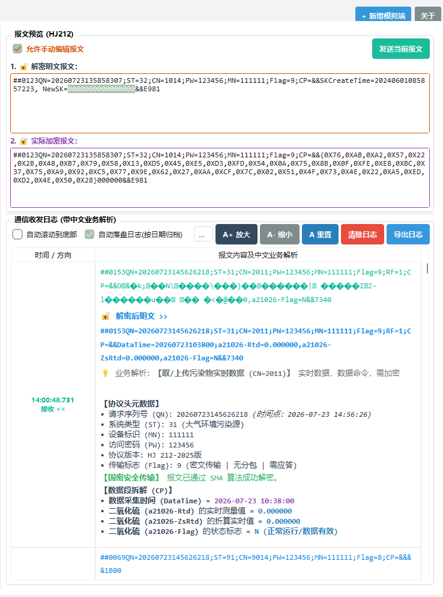

# HJ 212-2025 双端模拟与协议调试工具

一个高性能的环保数据传输规范测试工具。用于模拟 **上位机（环保平台）** 与 **现场机（数采仪/在线分析仪）**，遵循 《HJ 212-2025》、《HJ 212-2017》 与 《HJ/T 212-2005》 标准。

适合环境监测设备厂商、上位机软件开发商、环保物联网运维人员进行 **本地双端对调、现场设备联调、国密 SM4 加密验证、超长分包测试、异常低值修正及报文业务拆解**。

---

## 🌟 核心特性

- **同窗双端独立模拟**：可在同一个界面中动态切换“模拟端 1”与“模拟端 2”，一键配置上位机（接收端）或现场机（发送端），双端互不干扰。
-  **国密 SM4 加密支持**：遵循 HJ 212-2025 附录 A.2 标准（ECB 模式、Nopadding、16字节切片），支持十六进制密文 `&&{Hex}&&` 与字符密文的双重自适应解密。
-  **超长报文分包与重组**：自动计算 `PNUM`/`PNO` 拆分多包发送，接收端具备防 `\r\n` 截断的二进制流缓冲区，重组完整报文后再触发自动应答。
-  **Flag 标志位位运算引擎**：基于标准算式生成 Flag，自动解析 2025版、2017版、2005版协议版本。
-  **真实传感器波动与工况状态机**：内置正弦波振幅、高斯随机噪声及 `N`(正常)、`Stc`(稳定)、`Td`(故障)、`C`(校准) 4 阶段工况自动轮换引擎。
-  **HTML 会话日志自动落盘归档**：启动连接时自动在 `logs/yyyy-MM-dd/` 文件夹下按日期归档落盘 HTML 日志，采用追加流写入，全量 100% 留存。

---

## 📸 界面功能导览与配置截图

### 1. 双端通信角色与网络配置

软件支持上位机（Server/Client）与现场机（Server/Client）独立动态切换：

| 🏢 上位机模拟端 (Upper Role) | 🏭 现场机模拟端 (Field Role) |
| :---: | :---: |
|  |  |

---

### 2. 报文参数编辑与可视化构造

支持对 `QN`, `ST`, `CN`, `PW`, `MN`, `Flag`, `PNUM`, `PNO` 及 `CP` 数据段进行图形化编辑与即时校验，自动计算 `Flag` 值并高亮呈现：

---

### 3. 编码字典一键插入与传感器波动模拟

点击左侧参数区 **`【编码字典与模拟】`** 选项卡，在 **`【真实传感器数据波动模拟】`** 分组框中开启数据与工况自动轮换模拟：

---

### 4. 报文实时预览、解密明文拆解与日志搜索导出

右侧面板提供原报文预览、SM4 解密明文、中文业务明细拆解，支持日志过滤检索与 HTML 导出：

---

## 
